Copy from Profisee REST API to JSON Format
==========================================

This article describes a solution template that you can use to copy
records from Profisee REST API to Azure Data Lake Storage Gen2 storage,
in JSON format.

About this solution template
----------------------------

This template retrieves records from Profisee REST API. It then copies
the records, in JSON format, to a file in an output container. The
template is designed to work with a folder structure consisting of
folders named for each entity within the output container. Create a
folder for each entity you wish to integrate with. JSON files for an
entity will get created to the profisee-output\\&lt;entity&gt; folder.

When the pipeline created by the template is run, it will create a
folder for the entity, if it doesn’t exist, and copy the file to that
folder. The file name is composed of the entity name and date/time in
UTC with the .json extension.

For example:

-   profisee-output
    -   account
    -   customer
    -   product

How to use this solution template
---------------------------------

1.  Go to the **Copy from Profisee REST API to JSON** template.

    

1.  Create a **New** or use an existing connection to the source
    Profisee REST API.

    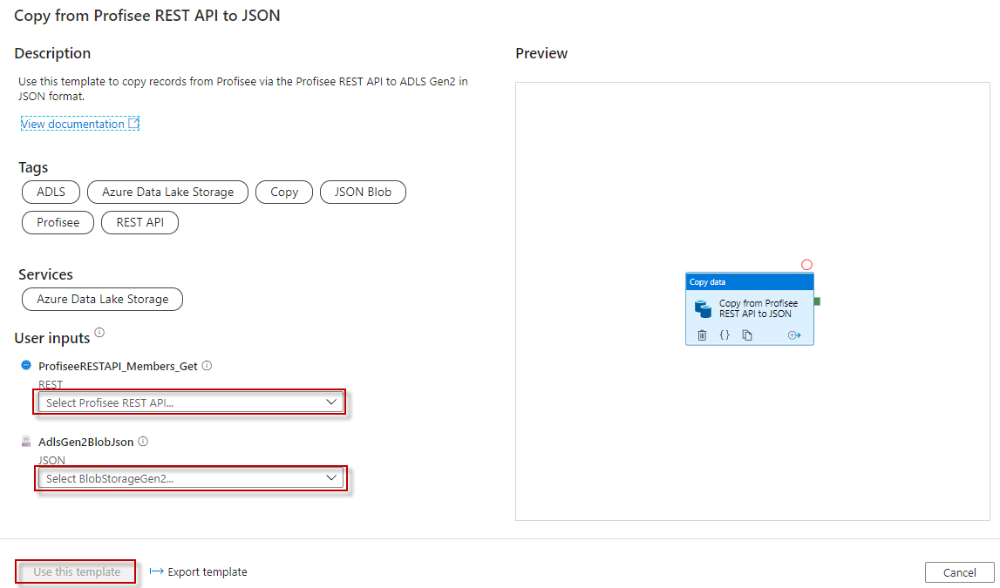

    Follow these steps if you need to create a new REST linked service.
    
    1.  Select “+ New" from the **REST** dropdown list.
    
        
    
    2.  Enter the following information for the REST linked service.
    
        1.  Name: Enter a unique name within your ADF.
        2.  Description: Enter an optional description.
        3.  Integration runtime: You can select the auto resolve option or
            create a custom integration runtime. Some linked services that
            ADF integrates with requires the ADF integration runtime be in
            the same region as the service. In this case you will need to
            create a custom integration runtime in the same region as that
            linked service.
        4.  Base URL: enter the base URL to your deployed Profisee REST API.
        5.  Authentication type: select **Anonymous**
		6.  Add a new Auth header for the **X-API-Key**.  The Profisee API key, which is the Client Id for the user account you are using to connect to the Profisee API. The Client Id can be found in the FastApp Studio Accounts screen, within the Accounts and Teams admin area.  You have two options.
			1.  Enter the API Key value directly into the Value field.  
			2.  Store the API Key in Azure Key Vault.  Although there are more steps involved, this is the preferred, more secure option.  
				1. Click in the value field then click **Add Azure Key Vault** to start the process to your store the value in Azure Key Vault.  
				2. Select **+ New** to create a new Key Vault, or select an existing Key Vault to use. 
				3. Your Key Vault will need an Access Policy allowing the Data Factory's managed identity access.
				   1. If not done during the create new process, after selecting the Key Vault name, click on the **Grant Data Factory service managed identity access to your Azure Key Vault.** link.
				   2. This will navigate to your key vault's Access Policies screen to add the necessary access policy.
				      1. Secret permissions: Get
					  2. Select principal: Click on **None selected**.  Search for the name of your Data Factory.  Click on it then click on **Select**.
					  3. Click on **Add**
					  4. Click on **Save** on the Access policies screen.
				4. Enter the Secret name you are going to use (e.g. profisee-rest-gateway-api-key).
				5. Navigate to your key vault to add the API Key as a secret. 
				   1. Click on **Secrets** in the left nav panel.
				   2. Click on **Generate/Import**.
				   3. Leave **Upload options** set to **Manual**.
				   4. Give your secret a name (e.g. profisee-rest-gateway-api-key).
				   5. Enter the API Key value in the Value field.
				   6. Click **Create**.
				6. You may need to refresh your Data Factory in the browser to pick up the new Key Vault settings.
				7. See [Store credential in Azure Key Vault](https://docs.microsoft.com/en-us/azure/data-factory/store-credentials-in-key-vault) for more information on the necessary steps.
			3. Should you need to use different API Keys with differing permissions to records in Profisee, you will need to create a REST linked service for each API Key you need to use.  And if storing the API Key in Key Vault, create a secret for each API Key.  You could also use one REST linked service.  You would need to instead add the API Key header in each Copy Activity's Source or Sink.  However, you would not be able to store the value in Key Vault.
    
        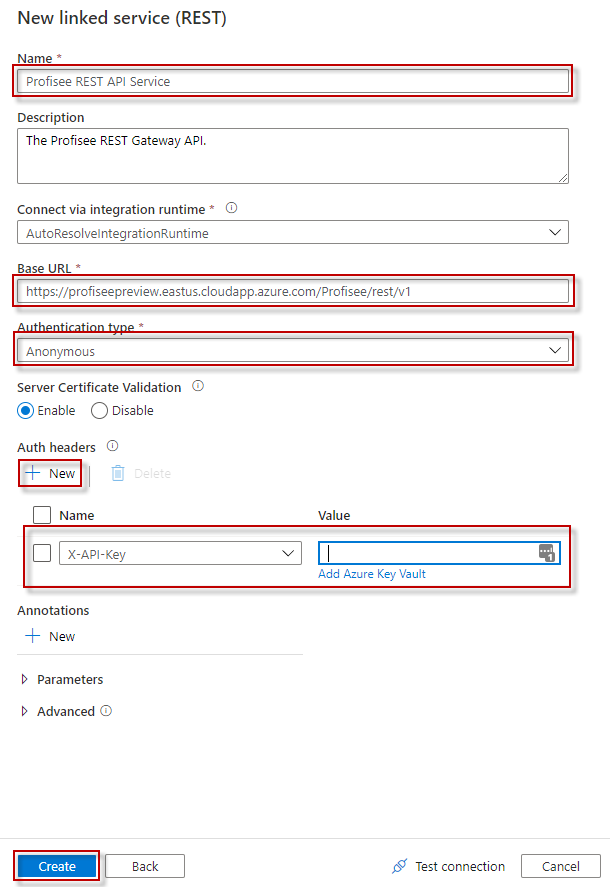

3.  Create a **New** or use an existing connection to the ADLS Gen2 sink
    data store that you are copying data to.

4.  Select **Use this template**.

5.  You will see a pipeline created as shown in the following example:

    

Pipeline
--------

### Variables

1.  **OutputContainer:** The output container where you are copying the
    file to. It defaults to “profisee-output”. You can update to
    another name based on your environment.

2.  **EntityId:** The entity you are copying records for. Note, the
    entityId can be either the entity’s Name, UID, or InternalId
    value.

    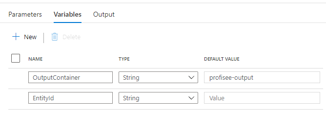

Copy Activity
-------------

### Source

1.  Dataset properties:

    1.  **entityId** - Uses the EntityId variable value.
    
    2.  **pageSize** - The page size to get.  Defaults to 1000 if not supplied.
    
    3.  **filter** - A filter to restrict the records returned.
        1.  \[&lt;attribute name&gt;\] &lt;operator&gt; &lt;value&gt;.
            -   Example: \[Color\] eq ‘BLU’.
        2.  The filter can include multi-level attributes (MLAs).
            -   Example: \[ProductSubCategory\]/\[ProductCategory\] eq '1'.
        3.  You can group attributes together using parenthesis and ANDs and ORs.
    
    4.  **attributes** - A comma separated list of entity attribute names to
        return.  The list can include multi-level attributes (MLAs). If
        blank, all attributes are returned. Note: the attribute list
        determines the result properties you will see in the **Mapping**
        tab.
        1.  MLAs are supported, using the ‘/’ to separate each part of the MLA path
        2.  Example: \[Color\],\[Class\],\[ProductSubCategory\],\[SellStartDate\],\[SellEndDate\],\[Weight\],\[ProductSubCategory\]/\[ProductCategory\]/\[ProductGroup\]
    
    5.  **orderBy** - A comma separated list of entity attribute names and direction to order the response
        1.  \[&lt;attribute name&gt;\] or \[&lt;attribute name&gt;\] asc - sorts attribute in ascending order
        2.  \[&lt;attribute name&gt;\] desc - sorts attribute in descending order
        3.  Example: \[ProductSubCategory\], \[SellStartDate\] desc
    
    6.  **dbaFormat** - The domain-based attribute (DBA) format to return.
        Provides an option to indicate how to return the DBA's Code and
        Name.  Note: a DBA is an attribute that points to, or references,
        another entity, called a domain entity. 
        1.  Code only (default) - Only return the code value.
            -   Example: 
                -   "Source System": "SF",
        2.  Code and Name simple properties.  The name property is returned as DBA.Name.
            -   Example: 
                -   "Source System": "SF",
                -   "Source System.Name": "Salesforce",
    
    7.  **recordCodes** – A comma separated list of record codes to restrict the records returned. 
    
    8.  You can find more information on these parameters on the Profisee REST API Swagger page. You can find it at https://&lt;host 
        name&gt;/Profisee/rest.
    
        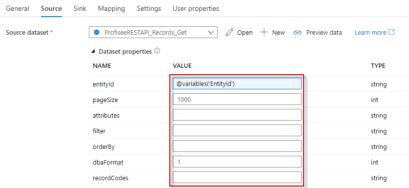

### Sink

1.  Dataset properties

    1.  FolderName – A concatenation of the OutputContainer and the EntityId.
    2.  FileName – A concatenation of the EntityId and a timestamp.
	
    

### Mapping

Select **Mapping** tab to map the records result properties to the corresponding JSON column.

First click the **Import Schemas** button. You will be prompted to confirm the value of the pipeline variable for the EntityId. Click **OK**.

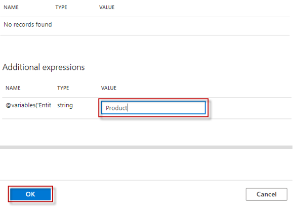

After a couple of seconds, you will see a list of mapping fields
listed, as shown in the following example.

Next, select **data** from the **Collection reference** drop down
list. The **data** property is the array of records.

Unselect the Include checkboxes for the pageNbr, pageSize,
resultCount, totalPages, totalRecords, and nextPage properties as we
do not want to copy them to the file.

After selecting the data collection reference, you need to correct the
Column names for each property you want to copy by removing the
**\[‘data’\]\[0\]** part of the column name.

From this

  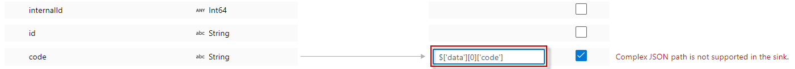

To this

  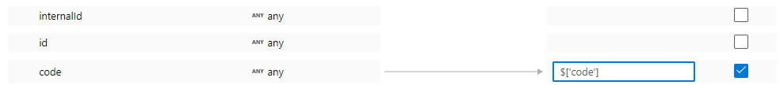

**Quick Tip:** Depending on the number of fields, correcting the
column name may take several minutes. Click the { } (Code) icon in the
right side of the pipeline toolbar.

  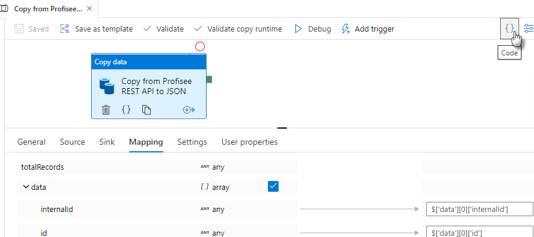

Scroll down to the mappings section. Then select **\[‘data’\]\[0\]**
and press Ctrl+H to replace this string with an empty string. Press
the Replace all button. Once done replacing, press the OK button.

  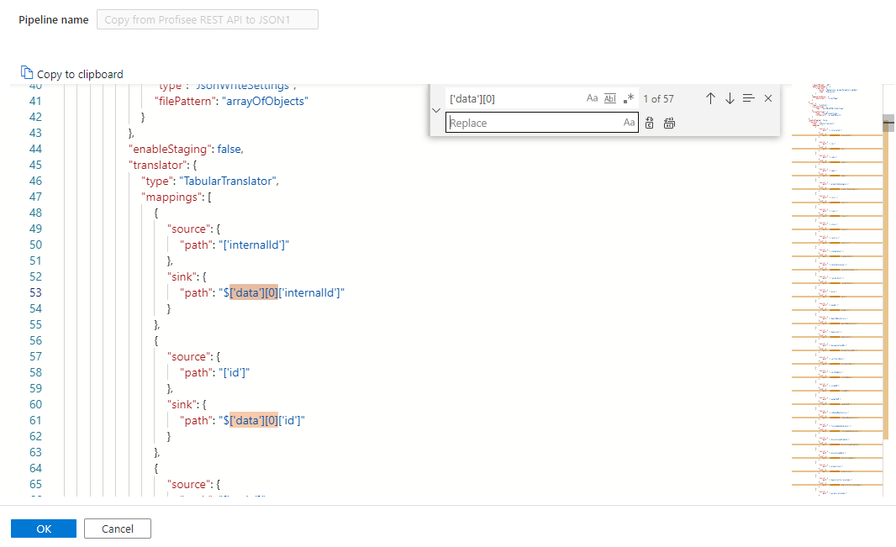

Go back into the Copy data Mapping tab and now your Column names should all be updated.

  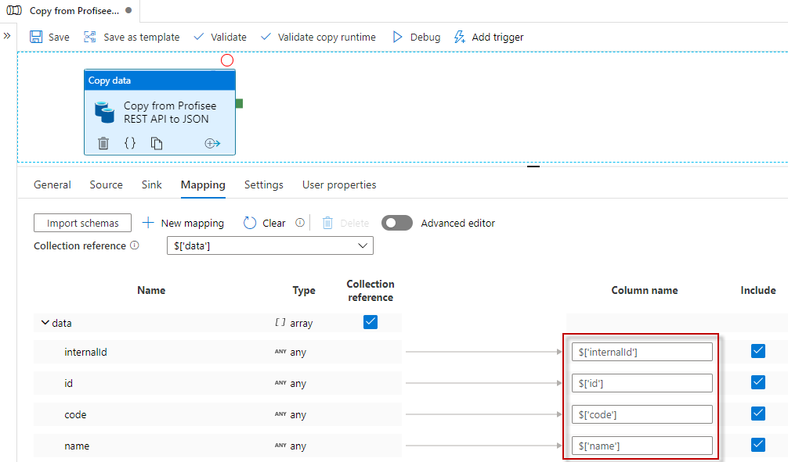

Publish
-------

Once you are finished with all your changes, click **Publish All**.

Triggering
----------

1.  To run the pipeline now, select **Add Trigger** and select **Trigger
    now**. Press **OK** at the Pipeline run prompt.

2.  Select **Monitor** tab in the left navigation panel and wait for
    about 20 seconds. Click **Refresh** to get the updated run status.

3.  When the pipeline run completes successfully, you would see results
    like the following example:

    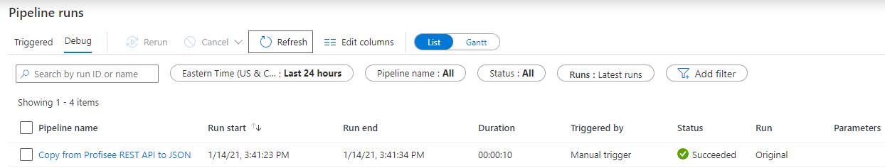

4.  You should also see the output file in the Container and Directory
    you entered.

    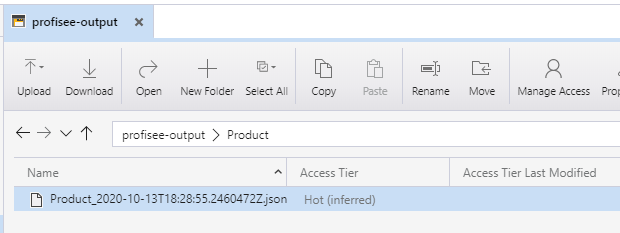

Next steps
----------

-   [Introduction to Azure Data
    Factory](https://github.com/MicrosoftDocs/azure-docs/blob/master/articles/data-factory/introduction.md)
